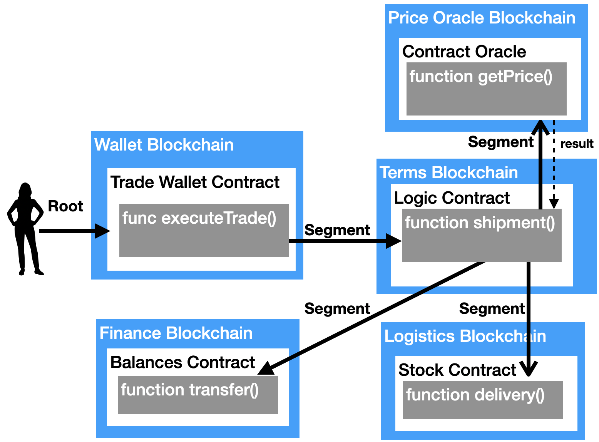

# General Purpose Atomic Crosschain Transactions Protocol

This repo contains the General Purpose Atomic Crosschain Transactions (GPACT) 
protocol implementation and associated protocols. It contains Solidity contracts, Java library
code, test code, and example code. It contains Docker files to run multiple blockchains using 
Hyperledger Besu so that the entire system can be run on a laptop computer. 
The GPACT Protocol is described in this paper: https://arxiv.org/abs/2011.12783.

## Crosschain Protocol Layers
GPACT forms part of an overall crosschain protocol stack as shown in the diagram below.
The links in the table below will take you to implementations of those parts 
of the protocol stack.

<table>
<thead>
<tr>
  <th>Crosschain Protocol Layer</th>
  <th>GPACT (Atomic Updates)</th>
  <th>SFC (Not Atomic Updates)</th>
</tr>
</thead>
<tbody>
<tr>
  <td rowspan=3>Crosschain Application Layer</td>
  <td>Examples:  
    <a href="./examples/gpact/conditional/">Conditional Execution</a> 
    <a href="./examples/gpact/hotel-train/">Hotel Train problem (3 blockchains)</a> 
    <a href="./examples/gpact/read/">Read across chains</a> 
    <a href="./examples/gpact/erc20bridge/">ERC 20 Bridge</a> 
    <a href="./examples/gpact/trade/">Trade-Finance (5 blockchains)</a> 
    <a href="./examples/gpact/write/">Write across chains</a> 
  </td>
  <td>Examples: 
    <a href="./examples/sfc/erc20bridge/">ERC 20 Bridge</a> 
    <a href="./examples/sfc/erc721bridge">ERC 721 Bridge</a> 
    <a href="./examples/sfc/write/">Write across chains</a> 
  </td>
</tr>
<tr>
  <td>Applications: 
    <a href="./applications/gpact/erc20bridge/">ERC 20 Bridge</a> 
  </td>
  <td>Applications: 
    <a href="./applications/sfc/erc20bridge">ERC 20 Bridge</a> 
    <a href="./applications/sfc/erc721bridge">ERC 721 Bridge</a> 
  </td>
</tr>
<tr>
  <td>Helper contracts: 
    <a href="contracts/contracts/src/application/lockablestorage">Lockable storage</a> 
  </td>
  <td>
  </td>
</tr>

<tr>
  <td rowspan="2">Crosschain Function Call Layer</td>
  <td colspan=2>
    Interfaces: 
    <a href="contracts/contracts/src/functioncall/interface">Solidity Contracts</a>, 
    <a href="./sdk/java/src/main/java/net/consensys/gpact/functioncall">Java SDK</a>
  </td>
</tr>
<tr>
  <td>
    General Purpose Atomic Crosschain Transaction (GPACT): 
    <a href="contracts/contracts/src/functioncall/gpact">Solidity Contracts</a>,
    <a href="./sdk/java/src/main/java/net/consensys/gpact/functioncall/gpact">Java SDK</a>
  </td>
  <td>
    Simple Function Call (SFC): 
    <a href="contracts/contracts/src/functioncall/sfc">Solidity Contracts</a>, 
    <a href="./sdk/java/src/main/java/net/consensys/gpact/functioncall/sfc">Java SDK</a> 
  </td>
</tr>
<tr>
  <td rowspan="2">Crosschain Messaging Layer</td>
  <td colspan=2>
    Interfaces: 
    <a href="contracts/contracts/src/messaging/interface">Solidity Contracts</a>, 
    <a href="./sdk/java/src/main/java/net/consensys/gpact/messaging">Java SDK</a> 
  </td>
</tr>
<tr>
  <td colspan=2>
    Messaging implementations: 
    Event Attestation:
    <a href="contracts/contracts/src/messaging/eventattest">Solidity Contracts</a>, 
    <a href="./sdk/java/src/main/java/net/consensys/gpact/messaging/eventattest">Java SDK</a> 
    Transaction Receipt Root Transfer:
    <a href="contracts/contracts/src/messaging/txrootrelay">Solidity Contracts</a>, 
    <a href="./sdk/java/src/main/java/net/consensys/gpact/messaging/txrootrelay">Java SDK</a> 
    Event Relay:
    <a href="contracts/contracts/src/messaging/eventrelay">Solidity Contracts</a> 
    

Services: <a href="./services/relayer">Relayer / Attestor</a> 
    

  </td>
</tr>
</tbody>
</table>

Applications use the Crosschain Function Call code to execute function calls across blockchains.
Crosschain Function Call code uses Crosschain Message Verification to ensure information from
one blockchain is trusted on another blockchain. The layers of the protocol stack are separated
by interfaces. Using common interfaces allows applications to use a variety of crosschain 
function call implementations, and for crosschain function call implementations to use a variety
of crosschain messaging implementations. Importantly, this allows for different
crosschain messaging systems to be used for different blockchains and rollups. It
allows applications to choose use lighter weight non-atomic function call approaches 
(which may be less costly and have lower latency) for low cost and less important transactions
and fully atomic protocols such as GPACT for more important business critical transactions.

Applications that are written for atomic crosschain function protocols will 
be different to non-atomic function call protocols, because the non-atomic
implementations need to handle failures where an execution occurs on a source
blockchain by not a destination blockchain. 

It is expected that more Crosschain Messaging and Crosschain Function Call
implementations will be written. Additionally, more example 
application code will be written. Please get in contact if you are interested
in writing an implementation or an example.

## GPACT

The General Purpose Atomic Crosschain Transaction protocol is a blockchain technology
that allows function calls across blockchains that either updates state on all 
blockchains or discards state updates on all blockchains. The function calls can 
update state on each blockchain and return values across blockchains. The protocol 
enables applications to access information and utilise functionality that resides 
on one blockchain from other blockchains. Unlike previous atomic crosschain protocols 
that only offer atomic asset swaps, this protocol allows for general purpose application logic.

The figure above shows a logical representation of a crosschain call graph using the protocol. 
A trade finance application creates a crosschain function 
call that goes across five contracts on five blockchains to execute a trade for a shipment of goods. 
The Root Transaction executes the entry point function, the `executeTrade` function in the 
`Trade Wallet` contract on the `Wallet` blockchain. The `Trade Wallet` contract could be a 
multi-signatory wallet that parties to a shipment have to submit a transaction to, indicating that they agree 
a shipment for a certain quantity of goods has been made and should be paid for. The 
`executeTrade` function calls the shipment function in the `Logic` contract on the `Terms` blockchain 
to determine the price that should be paid and to affect the transfer of stock and payment. The 
`shipment` function calls the `getPrice` function on the `Oracle` contract on the `Price Oracle` 
blockchain to determine the price that should be paid for the goods, then calls the `transfer` 
function on the `Balances` contract on the `Finance` blockchain to affect the payment, and finally 
calls the `delivery` function on the `Stock` contract on the `Logistics` blockchain to register the 
changed ownership of the goods.

It could be argued that some of the contracts could exist on the one blockchain, thus reducing 
the need for crosschain transactions. However, the `Finance` blockchain and the `Logistics` 
blockchain in particular could be consortium blockchains involving different participants. 
The `Price Oracle` blockchain could be operated by a consortium that charged for access to the 
information. Government regulators could require the logic on the `Terms` blockchain visible to
them, but the participants in the trade wallet on the `Wallet` blockchain may wish to remain 
anonymous. A crosschain transaction capability is needed to meet these requirements.

## More information
[How to build](./docs/build.md)

[Reproducing Performance Results](./docs/perf.md)

[Design documentation](./docs/)

