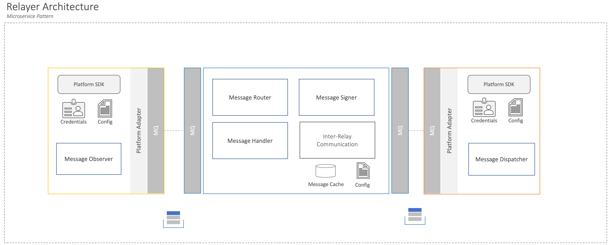
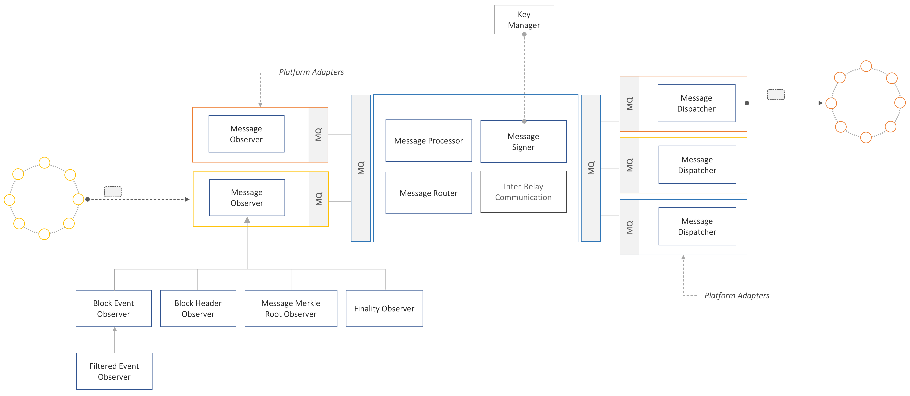
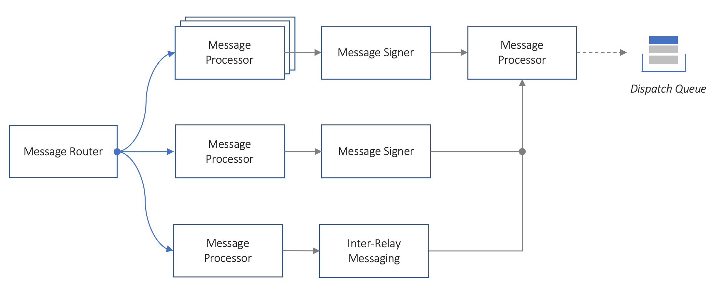
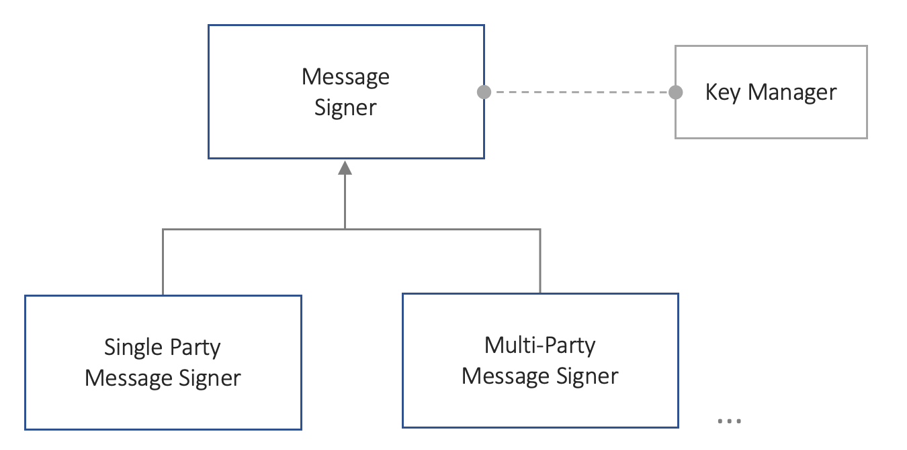

# Relayer High-level Architecture

Version: 0.1 (DRAFT)\
Date: 18/11/2021

## Overview
The Relayer is an off-chain system that is responsible for receiving cross-chain communication messages from a source network and delivering them to one or more destination networks. A Relayer might perform additional duties such as attesting to the validity of messages being communicated. A Relayer will generally interface with two or more networks and support a wide range of message communication needs, amongst applications across those networks. A Relayer might operate independently or in coordination with other distinct Relayers that are owned and managed by other parties.

## Core Capabilities
The Relayer offers the following set of core capabilities:
- Listen to cross-chain communication messages originating from a source network
- Attest to the validity of given message, based on the finalised state of the source ledger
- Coordinate with other Relayers as required to attest to messages
- Deliver cross-chain communication messages to one or more destination networks
- Serve as part of one or more bridges, to perform the above capabilities.

In addition to these core-capabilities, a relay might offer a number of supportive capabilities, such as use-case specific message processing requirements, service administration functionalities etc.

## Design Considerations
 The capabilities of the system can be seen in two parts, a) the protocol specific capabilities, such as reading and writing to specific network protocols b) the protocol-agnostic capabilities, such as processing and signing messages and communicating with other relayers as required. The design of a Relayer has to afford a significant amount of extensibility for the former while allowing for flexibility and variability in the operations of the latter. Such a design would enable a Relayer to cater for a growing number of network protocols, while at the same time catering to a wide array of use-cases with different message processing and attestation requirements.

From a process perspective, the operations of a Relayer can be seen as consisting of three distinct phases, receiving messages, processing messages and delivering messages. Each of these phases have different non-functional requirements and constraints (latency, scalability, security etc). Minimising the coupling of these phases would enable freedom to serve the needs of each independently.

## Architecture
The core aspects of the proposed architecture can be summarised as follows:
- Separate protocol-specific functionality from protocol-agnostic ones.
- Decouple the three-phases of relaying cross-chain messages, i.e. 1) receiving 2) processing and 3) delivering
- Enable variability and extensibility at the edges (1 and 3), and consistency with flexibility at the core (2).
- Decouple network Read from Write operations, as these might have different non-functional requirements (performance, scalability, security etc.)

The proposed architecture involves three distinct component types: 1) *Message Observer*, 2) *Message Dispatcher* and 3) the *Relayer Core*. 1 and 2 are *platform adapters* (*network adapters*) that interact with networks to read and write messages respectively to networks, while the Relayer Core is responsible for performing common message processing operations and routing messages between protocol adapters. The Relayer core interacts with protocol adapters through a message queue.



The protocol adapters (*Message Observer* and *Message Dispatcher*), provide points of extensibility for different networks and network message types. A *Relayer Core* interacts with multiple protocol adapters representing different Networks, and message configurations.



### Platform Adapters
The platform adapters are Blockchain protocol specific components, that interact with a given network. They act as clients on a network, able to read or write to the ledger according to the protocol specifications of the underlying network. They would typically leverage existing tools and SDKs for a protocol and can be built using different languages or frameworks.

#### Message Observer
The Message Observer, subscribes to state-change events on a designated Blockchain, annotates these events with additional metatdata, wraps them onto a common message data-model and places it onto a queue for processing by the Relayer core. The Observer could be configured listen to events emanating from a specific bridge contract, in a simplified setting, or extended to observe more complex state-change events (different filters, granularities, time-intervals etc.).


#### Message Dispatcher
The Message Dispatcher receives messages from the Relayer core through a message queue and submits the message as a transaction on the destination blockchain. This default implementation of this component would enable submitting the message to a designated bridge, but this could be configured or extended to offer different behaviour. The Message Dispatcher maintains cryptographic credentials with which to transact, with the underlying network.

### Relayer Core
The need to process messages and route them to one or more destinations is largely protocol-agnostic. These capabilities are thus provided as part of the Relayer core, which acts on network messages,  after they have been transformed/wrapped in a protocol-independent message data-model, by a Message Observer.  The service is responsible for receiving blockchain messages, identifying how the specific message should be processed, attesting to the message if required, and finally handing the message to the appropriate Message Dispatcher. The services utilises a number of configurable and extensible components to achieve these capabilities.

#### Message Router
A Message Router, maps message types and destination information to specific message handling workflows. When a message is received by the Relayer Core, the router is responsible for determining what specific message handling workflow needs to be triggered, based on context information provided in the message, and pre-specified message routing configurations.   



#### Message Processor
A Message Processor is a component that performs a discrete operation on a message. Message processors would typically be chained together into a workflow, in a chain-of-handlers pattern, to orchestrate more complex operations on a Message. Common Message Processor implementations include, validating message, persisting messages, aggregating messages, orchestrating the signing of messages and placing messages to a dispatch queue for delivery to a destination chain. A library of such message processor components, can be developed overtime, and weaved together in different ways to cater for a wide array of use-cases.

#### Message Signer
The Message Signer, is responsible for signing and attesting to the validity of messages on behalf of the Relay operator. The component might interact with external key-management components or services to perform this operation.



### Message Format
Messages communicated across the different components are encoded as JSON, and adhere to the data scheme specified [here](./relay-schema.json) and exemplified below:

**Message**
```jsonc
{
   "id":"", // Unique identifier for a message generated in a source blockchain
   "meta":{
      "type":"",  // Message type discriminator
      "timestamp": "2021-11-19T20:00:10Z"  // Timestamp for when message was generated
      "destination":[ // Details of one or more destination contracts to relay message to
         {
            "networkId":"",
            "bridgeAddress":"", // The bridge contract to deliver message to.
            "contractAddress":"" // The ultimate contract that will consume this message
         }
      ],
      "source":{ // Details of the originator of this message
         "networkId":"",
         "bridgeAddress":"",   // The bridge contract that initiated the cross-chain message.
         "contractAddress":"" // The address of the contract that initiated the cross-chain message
      },
   },
   "proofs":[
      {
         "type":"EcdsaSecp256k1Signature2019", // Type of cryptographic method used to prove authenticity or validity of message
         "created":"2021-11-19T20:00:10Z",  // Timestamp of when the proof was created
         "proof":"Base64EncodedString" // Base64 encoding of proof
      }
   ],
   "payload":"Base64EncodedString" // Base64 encoded of message from source blockchain
}
```

#### TODOs
- [x] Message format
- [ ] Interface definitions for Components
- [ ] Example flow
- [ ] Example sequence diagrams
- [ ] Deployment considerations
- [ ] Inter-relay communication
