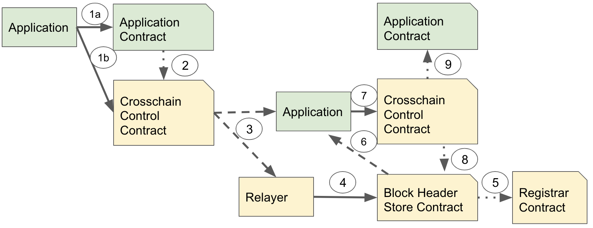

# Relayer Usage

The purpose of this document is to provide an overview of the information
flows for various messaging layer and function call layer configurations.

Not all function call layer protocols will work with all messaging layer
protocols. The table below shows which will work together.

<table>
<thead>
<tr>
  <th rowspan=2>Messaging Layer Protocol</th>
  <th colspan=2>Function Call Protocol</th>
</tr>
<tr>
  <th>GPACT and other atomic protocols</th>
  <th>SFC and other non-atomic protocols</th>
</tr>
</thead>
<tbody align="center">
<tr>
  <td>Event Relay</td>
  <td>&#10007;</td>
  <td>&#10003;</td>
</tr>
<tr>
  <td>Transaction Receipt Root Relay</td>
  <td>&#10003;</td>
  <td>&#10003;</td>
</tr>
<tr>
  <td>Block Header Relay</td>
  <td>&#10003;</td>
  <td>&#10003;</td>
</tr>
<tr>
  <td>Event Attestation</td>
  <td>&#10003;</td>
  <td>&#10003;</td>
</tr>
</tbody>
</table>

The sections below gloss over a few points. Assume in all flows there are checks for:
<ul>
<li>Replay protection checks.</li>
<li>Checks that each signer is a valid signer for a blockchain.</li>
<li>Checks that signers only sign once.</li>
</ul>

## Event Relay
The diagram below shows the information flow for a system using
Event Relay with Simple Function Call protocol. The system could
be used with separate signing where each relayer submits separate
transactions to the destination blockchain, or a cooperative signing
approach where relayers work together to sign an event and then
submit just one transaction per event.

Note that this scheme does not work with GPACT. This simple scheme
does not require the application to have the ability to submit the
transaction on the destination blockchain.

Walking through the diagram:
<ol>
<li>Application submits a transaction that causes a function
 in an application contract to be executed.</li>
<li>The application contract calls the Crosschain Control contract to execute
 a crosschain function call.</li>
<li>The Crosschain Control contract emits an event indicating the destination
 blockchain, contract address, function call and parameters to be called.
 All relayers associated with the blockchain observer the event being emitted.
 Once the block containing the transaction that emitted the event is final
 relayers process the event.</li>
<li>The relayer signs the event and submits a transaction to the Signed Event Store contract
 containing the signed event.</li>
<li>The Signed Event Store contract verifies the signature of the event
 by calling the Registrar contract.</li>
<li>If a threshold number of relayers have submitted signed events, the
 Signed Event Store contract calls to the Crosschain Control contract.
 Once the event has been successfully actioned, a bool is set so not further
 action will be taken.</li>
<li>The Crosschain Control contract checks that the event has a threshold
 number of signatures.</li>
<li>The Crosschain Control contract calls the application contract with
 the specified function and parameters.</li>
</ol>

Relayer configuration items that must be set:
<ul>
<li>Contract address(es) to observe.</li>
<li>For each contract address, event signature hashes to observe.</li>
<li>Finality rules. This could be the number of block confirmation to
 wait before deeming a block final, or something more complex for
 systems the Ethereum Beacon Chain that have complex finality.</li>
<li>The target blockchain that all events should be transferred to. Doing
 this means that the relayer does not need to be able to interpret
 the event format.</li>
</ul>

Notes:
<ul>
<li>If multiple levels of finality should be supported, then multiple
 relayers should be run in parallel. Different Crosschain Control contracts
 could be used for each level of finality / crosschain transaction
  prioritisation.</li>
<li>An alternative to supporting level of finality via multiple relayers
 would be to have some standard
 fields in events from the function call layer, that the messaging layer
 could know about.</li>
<li>The messaging layer calling to the function call layer is not
 currently part of the Crosschain Protocol Stack specification.</li>
</ul>

## Block Header Relay and Transaction Receipt Root Relay
The diagram below shows the information flow for a system using
Block Header Relay. Transaction Receipt Root Relay is very similar,
transferring the transaction receipt root rather than the block header
containing the root. The system could
be used with separate signing where each relayer submits separate
transactions to the destination blockchain, or a cooperative signing
approach where relayers work together to sign an event and then
submit just one transaction per event.

Walking through the diagram:
<ol>
<li>Application submits a transaction.
  <ol>
  <li>For SFC: Execute a function in an application contract.</li>
  <li>For GPACT: Execute a function in the Crosschain Control contract.</li>
  </ol>
</li>
<li>For SFC: The application contract calls the Crosschain Control contract to execute
 a crosschain function call. For GPACT: The Crosschain Control contract might
 call the application contract, which in turn may call back to the Crosschain
 Control Contract.</li>
<li>The Crosschain Control contract emits an event containing information
 useful to the function call protocol. For SFC this indicates the destination
 blockchain, contract address, function call and parameters to be called.
 For GPACT this can be the call execution tree being committed to, return
 results from funcion calls, or whether provisional updates should be committed
 or discarded.

 All relayers associated with the blockchain observer the event being emitted.
 Once the block containing the transaction that emitted the event is final
 relayers process the event. Similarly, the application observes the event.</li>
<li>The relayer signs the block header of the block containing the transaction
 that emitted the event. This signed block header is submitted to the
 Block Header Store contract.</li>
<li>The Block Header Store contract verifies the signature of the block header
 by calling the Registrar contract.</li>
<li>The application waits until a threshold number of relayers have submitted signed
 block headers.</li>
<li>The application calls the Crosschain Control contract with one or more
 events, and associated Merkle Proofs, proving that the events were
 emitted by transactions in blocks.</li>
<li>The Crosschain Control contract checks that the proof can be used to
 verify the event with the block headers in the Block Header Store contract.</li>
<li>For SFC the Crosschain Control contract calls the application contract with
 the specified function and parameters. For GPACT, similar to 2.,
 the Crosschain Control contract might call the application contract,
 which in turn may call back to the Crosschain Control Contract.</li>
</ol>

Relayer configuration items that must be set:
<ul>
<li>Contract address(es) to observe.</li>
<li>For each contract address, event signature hashes to observe.</li>
<li>Finality rules. This could be the number of block confirmation to
 wait before deeming a block final, or something more complex for
 systems the Ethereum Beacon Chain that have complex finality.</li>
<li>The target blockchain to transfer all block headers to. Doing
 this means that the relayer does not need to be able to interpret
 the event format.</li>
<li>Threshold used for signing.</li>
</ul>

## Event Attestation
The diagram below shows the information flow for a system using
Event Attestation. The system could
be used with separate signing where each relayer submits separate
transactions to the destination blockchain, or a cooperative signing
approach where relayers work together to sign an event and then
submit just one transaction per event.

Walking through the diagram:
<ol>
<li>Application submits a transaction.
  <ol>
  <li>For SFC: Execute a function in an application contract.</li>
  <li>For GPACT: Execute a function in the Crosschain Control contract.</li>
  </ol>
</li>
<li>For SFC: The application contract calls the Crosschain Control contract to execute
 a crosschain function call. For GPACT: The Crosschain Control contract might
 call the application contract, which in turn may call back to the Crosschain
 Control Contract.</li>
<li>The Crosschain Control contract emits an event containing information
 useful to the function call protocol. For SFC this indicates the destination
 blockchain, contract address, function call and parameters to be called.
 For GPACT this can be the call execution tree being committed to, return
 results from funcion calls, or whether provisional updates should be committed
 or discarded.

 All relayers associated with the blockchain observer the event being emitted.
 Once the block containing the transaction that emitted the event is final
 relayers process the event. Similarly, the application observes the event.</li>
<li>The application requests the signed event from attestors.
 It gathers a threshold number of signatures.
 If a cooperative
 signing approach is used, then the application will only need to
 communicate with one attestor. Note that the signed event may not
 be available when the application requests it as the attestor may not deem
 the event to be final.</li>
<li>The application calls the Crosschain Control contract with one or more
 events, and associated signatures.</li>
<li>The Crosschain Control contract checks that the signatures are
 valid and that there are enough signatures by calling the Event Verifier
 contract.
<li>The Event Verifier contract calls the Registrar contract to check
 that signers are registered.</li>
<li>For SFC the Crosschain Control contract calls the application contract with
 the specified function and parameters. For GPACT, similar to 2.,
 the Crosschain Control contract might call the application contract,
 which in turn may call back to the Crosschain Control Contract.</li>
</ol>

Relayer configuration items that must be set:
<ul>
<li>Contract address(es) to observe.</li>
<li>For each contract address, event signature hashes to observe.</li>
<li>Finality rules. This could be the number of block confirmation to
 wait before deeming a block final, or something more complex for
 systems the Ethereum Beacon Chain that have complex finality.</li>
<li>For cooperative signing schemes: threshold used for signing.</li>
</ul>