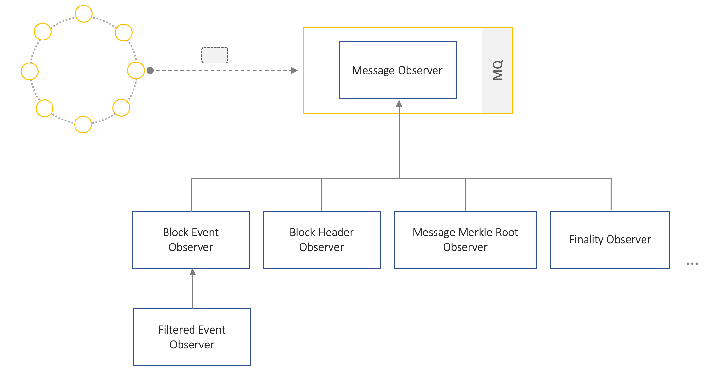

## Overview
The Message Observer is a [protocol-specific component](./relayer-design.md#design-considerations) that subscribes to state-change events on a Blockchain, annotates these events with additional metadata, transforms them to a common message format and sends them to the [*Relayer Core*](relayer-design.md#relayer-core) for processing. The component abstracts away blockchain specific details from the *Relayer Core* and offers a plugin-point for supporting new network types and messaging schemes, without affecting other Relayer components.  

An instance of this service can be very specialised (e.g. specific blockchain network and a bridging contract), or more general in nature. The former is conceptually simpler to work with and is the recommended approach for implementing, instantiating and operating observers.

## Key Features
The Message Observer performs the following set of core functionalities:
- Listen to relevant events originating from a source network
- Process and transform such events to a [common, protocol-agnostic message format](./relayer-design.md#message-format)
- Send messages to the core service for further processing, routing and dispatching

## Design
A Message Observer communicates with the Relayer core asynchronously through message queues.
It consists of four key interfaces: *Event Watcher*,  *Event Handler*, *Event Transformer* and *Message Handler*. Each of these interfaces can be extended to create observers with more complex behaviours.

Figure 1: Message Observer can be extended to observe different types of state-change events (example-only)

### Event Watcher
An *Event Watcher* is responsible for listening to events of interest in a given blockchain, and passing them to an *Event Handler* for processing. Watchers can be designed or configured to filter for different types of events. There are currently two implementations of this interface, *Realtime Event Watcher* and *Finalised Event Watcher*. The distinction between the two implementations is based on whether or not block confirmations are required.

Implementations of the *Event Watcher* interface offer two important *guarantees* to downstream consumers:
1. Only events that match configured filter criteria are delivered (e.g. specific contract address, event type)
1. All relevant events will eventually be delivered
1. Events delivered will be unique

However, it does **not** guarantee that:
- Events are delivered sequentially
- Events will not be affected by reorgs

#### Realtime Event Watcher
Listens for relevant events in realtime (as they are included into a block) and sends them over to an *Event Handler* for processing. This offers a very low latency mechanism for working with events. However, it is very likely that such events could be affected by reorgs, and so this component offers no assurance around *finality* of relayed events.

#### Finalised Event Watcher
Unlike a *Realtime Event Watcher*, a *Finalised Event Watcher* waits until an event receives a specified number of block confirmations before relaying the event to a handler. Provided block confirmations are set sufficiently high, this component offers better confidence around *finality*.  However, this comes at the cost of higher latency.

// todo: diagram and better explanation of how this component works.

### Event Handler
Is responsible for initiating (or even managing) a workflow that takes a raw event from an *Event Watcher*, processing it and ultimately sending it to the Relayer core. It relies on other component types for this purpose, i.e. other *Event Handlers*, *Event Transformers* and *Message Handlers*. There is currently a one implementation of this interface, *Simple Event Handler*, which executes a simple workflow that first transforms a raw event to a common message format (using an *Event Transformer*) and then passes the message to a *Message Handler*.

### Event Transformer
Converts a raw blockchain event to a [common, protocol-agnostic message format](./relayer-design.md#message-format), that can be consumed by downstream Relayer components. The primary guarantee offered by this component is that its output is always deterministic, for a given event.

The event transformer is also responsible for computing a deterministic message ID for a given event. The important properties that the employed ID scheme offers are:
1. Deterministic: The message ID should be deterministic for two reasons: a) different Relayers should be able to independently compute the same ID for a given event b) a duplicate event can easily be detected by downstream processes.
2. Semantic and reversible: Not only should an ID be computable from an event, but given a message ID an entity should be able to determine the specific event on the blockchain being referenced. One of the benefits of this is that, communication overheads between relayers when orchestrating joint signatures can be reduced by just referencing message IDs instead of sending complete message payloads.

However, the degree to which the ID scheme can guarantee the above properties is reliant on upstream processes mitigating the possibility of reorgs.

The current ID scheme implemented for a message involves the following structure: *{network_id}/{contract_address}/{block_number}/{tx_index}/{log_index}*.

### Message Handler
Similar to the *Event Handler* the *Message Handler* is responsible for initiating (or even managing) a workflow that takes a message, processes it and ultimately enqueues it onto a message queue for consumption by the Relayer core. There is currently only a single implementation of this interface, *Message Enqueue Handler*, which sends a given message to a specified queue.
