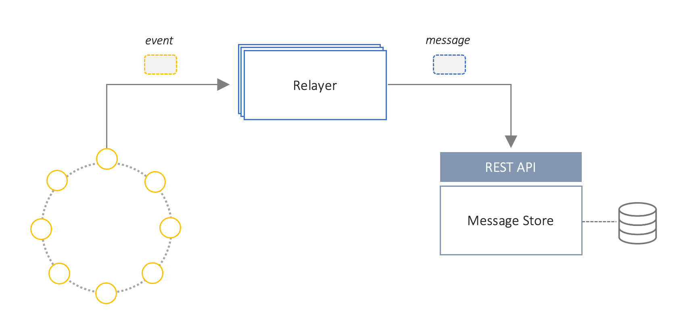

## Message Store Service
The *Message Store Service* is a simple REST service that stores messages forwarded from one or more Relayers, and serves them to clients upon request. 
This service is an essential component for protocols such as GPACT that rely on the ability of off-chain components to query for the state of specific messages.

### Features
- Store messages forwarded by Relayers
- Retrieve messages based on client request
- Aggregates proof information from multiple Relayers, if required
- Manage the lifecycle of messages if required (i.e. expiry and removal of messages)

### Design and Specification
The *Message Store Service* consumes events that have been processed by Relayers. 
The service can be configured to store all messages that pass through a Relayer or only a subset that require persistence (e.g. GPACT events).
A [specialised message dispatcher]("TODO") is responsible for forwarding messages to the store by interacting with its API.
Relayers can either create a message if it is not already in the Message Store, or update it with their own attestation (or other proof), if the message already exists.

The service is responsible for ensuring that all create and update operations on messages can only be performed by authorised Relayers.
The specific authentication and authorisation mechanism to use is TBD, however the scheme should minimise the level of configuration required on the Relayer services.
This is because a Relayer might in future work with multiple Message Stores, some of which could be dynamically specified on a per-event basis.
This requires that the amount of context information that a Relayer requires when interacting with a *Message Store* be minimal.

Figure 1: Relayer interaction with Message Store Service

The API for the *Message Store Service* is detailed in [this specification document](spec/message-store-service-api.yml).
It is defined using the [Open API Specification format](https://swagger.io/specification/) and can be displayed using the [Swagger UI tool](https://swagger.io/tools/swagger-ui/).

#### TODOs
- [ ] Security
- [ ] Message expiration and removal
- [ ] API versioning
- [ ] Deployment considerations