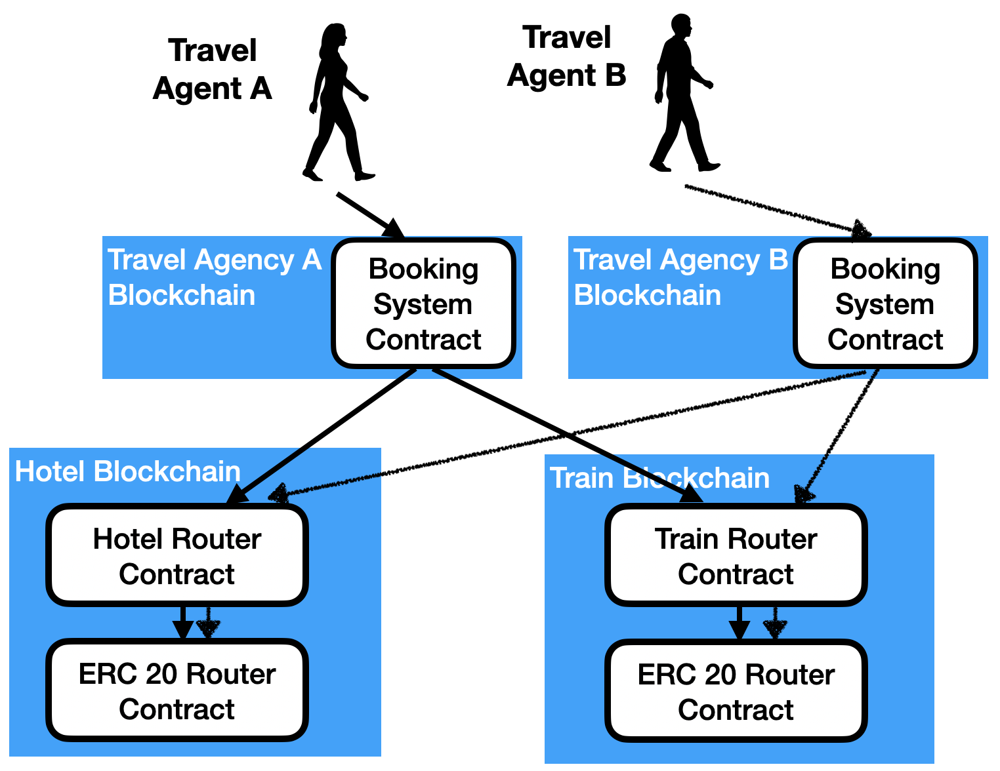

Hotel - Train Example
----------------
This example demonstrates how the hotel - train problem can be solved
using GPACT. The hotel - train problem is: a travel agency wants to 
book a hotel and a train. However, they don't want the hotel booking
if the train seat is not available, and vise-versa.

## Introduction
This sample demonstrates:
* A crosschain transaction that spans three blockchains. The travel
agency is on one blockchain. The hotel is on another blockchain. The
train is on a third blockchain.  
* The use of hotel and train contracts that lock individual 
  elements of the contract (single seats / hotel rooms). This 
  allows multiple simultaneous bookings.
* How to use the lockable ERC20 contract. This ERC 20 can be used
  in crosschain transactions, but can not be transferred to or from
  directly.
* Authentication EOA to a function in a contract.
* Authentication function in a contract on one blockchain calling a
  function in a contract on another blockchain.

## Running the Sample Code

This sample is to be used with three the Hyperledger Besu instances
each operating as a node on a separate blockchain. 

## Details

The diagram below shows the system architecture.

The Hotel operates a blockchain to allow travel agencies and individuals 
to book and pay for rooms. The Hotel has a Hotel contract to allow booking 
rooms and a modified ERC 20 contract to allow for payment of the rooms.
The ERC 20 allows for value transfers to be part of crosschain transactions. 

Similarly, the Train operates a blockchain with contract representing 
the train, and a lockable ERC 20 contract. The contract representing
the train is in fact an instance of the Hotel.sol contract. This was done because the 
only difference between the Hotel contract and a possible Train contact would be variable 
names (seat vs room). 

To book a hotel and train, the travel agency creates a call execution tree. This is 
passed to the Crosschain Execution Engine, that then executes the entire transaction,
managing the parts of the transaction (Start on Travel Agency blockchain, Segments
on Hotel and Train blockchains, then Root on the Travel Agency blockchains, the Signals
on the Hotel and Train blockchains).

Note in the Travel Agency contract that it authenticates the call to book a hotel room
and a train seat, and the Hotel contract authenticates the crosschain call from the 
Travel Agency, ensuring it is in fact the Travel Agency contract that is doing the call.

[Click on this link to see the sequence diagram of the Hotel - Train example](https://sequencediagram.org/index.html#initialData=C4S2BsFMAIHEAUCCBhAKtAEge2Jc0BaaVAJwEMQA7aAUQA8yBbABymgFcBnKgc1oDdIlYNETBcnYGVBZKALmgBlEC3AgAZiEgATAFAAjHMCwsyJUAGMQzMsM67dN8yCs3hPElnbNoAYjU8ABbAAJ544FgA7tAAVDGIzKwu0iCy0MhY2pBxjmaW1rYiCUkWKbIAdABWZPxkuc6uhUoAIgDSukJ6DvX5bsAeXj6+zFQA1rExpDV4ojxCFiHQAEIRFqMWgRSUOU69TQBEAEp4ZGEk0AD0ouKQklgk+9BknKLH4KeQJGISxiQ9LgV3J5vH4AsEPJAhBMALK3ThkHi8aAAGQ+JB2eQBfWg+2+t1+yh4lGOiMk5BI5U4WHAj2eojxdxIhOJkFJwHJlOp-0awhxyE8nE4Gy2ADVPhotEyQETOTSni8UAKhZsqGKSBLPszZR1KNpoNzAf1gUMwcB9OB2DA4gAxdiUCwyajIMjgfCos4YhqGvlK4VUDLCTzgWW0hX8rCCv2UAPs6nazoGvoDEH+aXgkiQRZxYpqUqOlFoz17Xn7KaCcCIOb2kIh+XEcjlyvzGtU8A6vQJxOFZNDCFZmLYXD4FZYNZRotYg5vNGXa4-e6h5bTs4M35doGDUFpo2Q6hxWGChFI92fCc8kS4m6M5kkkBksy1ulLVf3G+su-sh+t9cX8ORlWUGqGpSjKraLksf7KqK4qaJq0qUPGuo-j2W5BGaFpWjEtr2vmzqugWHoxD+PoRlB-qyLGwZgXWEG+gBMZBohei7JOG4pqafYTDmyT5ie6JESx544oOeCPi8IlUVygnevsyKjqMZDmpANCHMgABMAAM8AZpwkDANaIB0DoijeKwLbUuBclrIpUAqepWk6XpBlGdoJmJOA5ltgmnbSUmxp+JxcRTFQyyrOsAFnjJy6fLOL4PHWyDRV8V5rsh-mpmhEJQvucJHpQfB8ZF2KXvOIEsmyHLUXSyBxW+FVflJmJCfskFRkBsFlWJ6StQB7WSlq36dmlm4ZcE5qWhM2EOqkToum6hYCU1Mk9VsDFxlVLzICt5GButXI+UtfkjRxGb9txeYzQRp6LV6xXBQhG31ls2q+QcVkKUpdmadptxOYZxmmR5XXIO9NnKap32Ofp-2uYDnntgjDgALxI9AP1ODA6j3OkdFbE9lDwtNaQow4lA4DAWCCOc51lAh1S1AANC0rQKMojDsO8uDQBYuMhZ+BNkET1AADrCFg0BZLgJCMFQmN2kL0BOEwemfJw5Sk+T0CUzFNOOlUNRkEzihtAo-KQNIMClPhkBGRY7D5uykLq8jqPbdQUwCwrJO6zN+u1AQAB8xss7Qtv25bc3QDbkB2w7GaQC7cBIGgrNSOY0Ak8HgeKqRUZrZJ4AKJIeTQAAFBYJgyyIxjc5H0ex5djuQAAlBrXPa9Tbv57Kcg0FXAhCMAqd5A4WcB4gSVxQosB6dA7PgKAZmi9wRI6FHgjCInCAoKgrOsowg9l4YWDjJ4JhPCIgTk+AzcZ0juhj7Ruf0RRjGtkX++Dw4T--qtr97eAQOP8yKARgv1eCPcsgVyyIgXU7UQg0A3sAXQwC2pgLgqBakQDarwVvPeCk79oBUw0CEWB2hkCBBjqMVAgQdJX3AF0VBL9doF0DhJHu0Bj6jEOFgEwuh2GtiAaDT6EMHK-Whi5NyZkOH804OoT41pPCMFFmWGYTZqzQBrhJNuFMqbLC7v-Auvd+6IMHnvHgB9N4PzaEAyeKV7jT1nvPReHloAr0oGvSASDugoyTjvcxliRCly4W482Ig0ifioLfTONiA5bV5tGQxHDdIWK-roeJz8-4sNlIHDJv9VToM6u-KBmRIBkPgaYzeeSQF9QwQ9LBcScFEjwZ+Ah1IFDEPUKQ3UFCqE0LodSLo1S85JMEQHe6HCuGKDCboCZYyQbyTBl9MRukJEA3cp5BQsj5EkEUSYFRDY1FVgWJo8W90dFaz0cM5hlEe59zAAPYQAS0lj0SicFc9iSCOJEM46wrj3GeO8VvZOu9oA8JwHfaxrRs4GOyYQs+yDdA53yYkuFDTkU1MKQNdpJSYFwJggg7xGK0Hqg6tiwB48mnlQ-JVdpRCCVkN6Wsfptx6FdGJTct+DTVEVmOZszhvDRgSTIec3QZN256I5Vk25797kiEqUPMFvDEVjwnu8z4U84BOI5i4xYy94KArSboXx28U5KHgnNJEMToUByYdKrlhc3EWtdLwb+sKZUNLtQU0l4DMGF1xWU-FpLCVfy9aAn1dScm2qpS02ljrOndPIZQ5ltDWWDLdQk7uYyljCNsqIn6qznLrOkYQzQlAXR3hgKXDIjB+7Y2aHeUoJA9TME8PwO8M0XQcGYNoC2nBW7GtRqa0FzJLX5Uha891Dqi7OrUPlBw1z7UANyW7WpRScUx1KeUglCr0mrqxRA+ZMb3z4I4QmxlybqGps4GyhdU7l1xNzeDeyBa-qSLhhwstFbdJlxrXW84DahRmBbW2jtsgu3eF7RIVuQA)